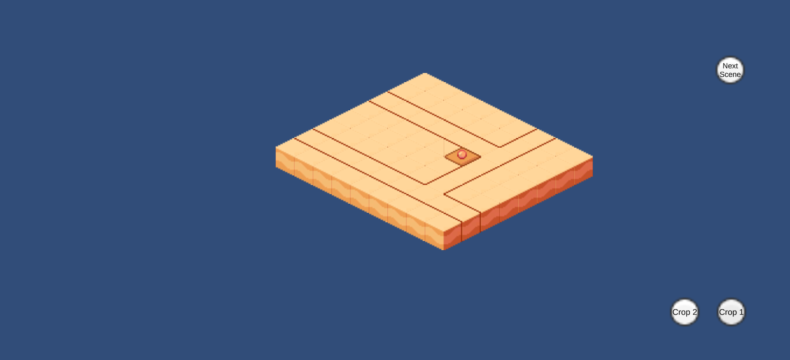
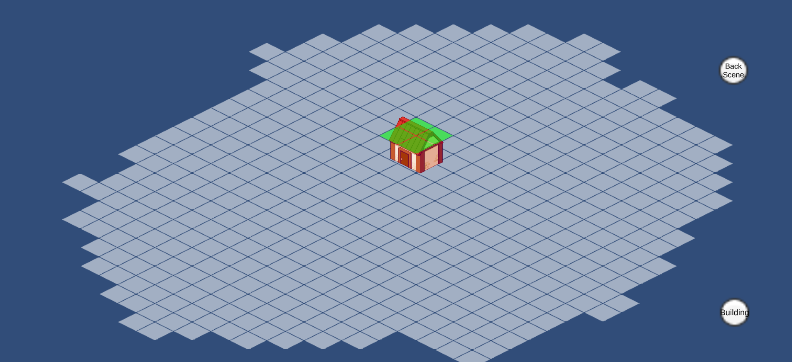
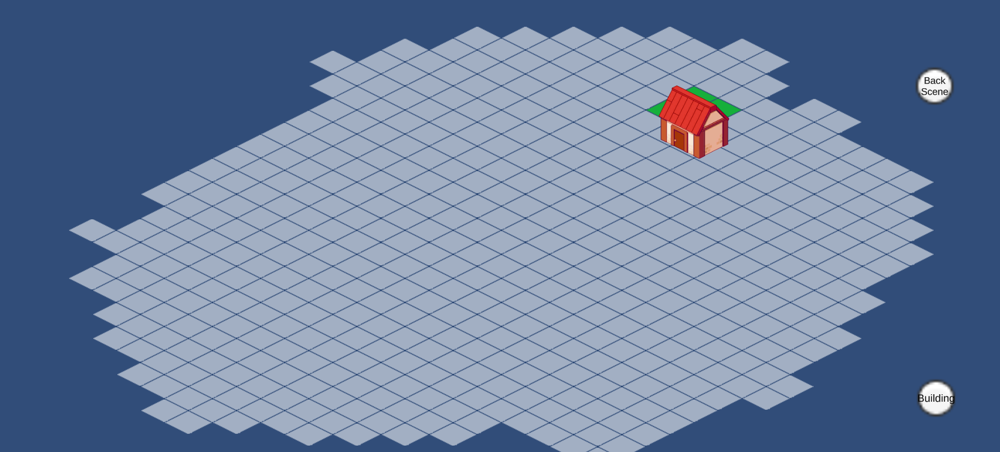
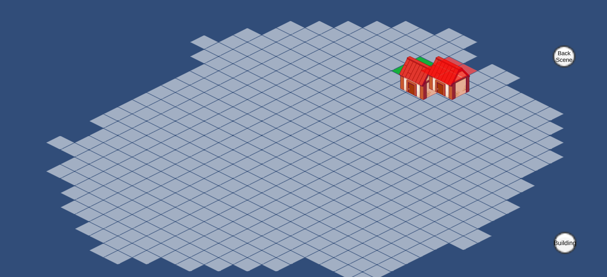

# WibeSoft_Case
Client Geliştirici Görevleri (Unity C#)
## 1. Görev: Tarım Sistemi
Bu görev kapsamında, ekim ve büyüme sürecini yönetmek için ScriptableObject (SO) tabanlı bir yapı tasarladım. Bu yapı sayesinde, tohumun tarla ile temasa geçtiği anda gerekli veriler saklanabilmekte ve farklı tohum türleri aynı sistem içinde çalışabilmektedir.

Tarla sistemini oluştururken katmanlı tilemap yapısını kullandım ve tek bir tarla üzerinden işleyişi sağladım. Projenin gereksiz büyümesini önlemek adına IEnumerator kullandım, ancak UniTask kullanımı her durumda daha verimli olacaktır. Mimari tasarım sırasında diğer mekanikleri göz önünde bulundurmadığım için sistem, bazı iyileştirmelerle daha genişletilebilir ve kullanışlı hale getirilebilir.

## 2. Görev: Bina Yerleşim Sistemi
Bu sistem iki ana kod yapısından oluşmaktadır:

TilemapGridSystem: Haritadaki uygun alanları kontrol eder, bu alanların kullanılabilir olup olmadığını günceller ve bina yerleşimini yönetir.
Building: Yapının kendi verilerini saklar ve seçilen alana yerleştirilip yerleştirilemeyeceğini kontrol eder. Aynı zamanda yerleşim işlemini onaylama sürecini de yönetir.

## Kullanım :
Görevleri sahnelere ayırdım

Tarım Sistemi Sahnesi

Button ile seçtiğiniz tohumu tarlaya yerleştirebilirsiniz.
Ekim süreci başladıktan sonra SpriteRenderer kullanılarak görsel değişimlerle büyüme aşamaları gösterilir.
Olgunlaşan ekin toplandığında, kullanıcıya konsolda bir geri bildirim verilir.
Sonraki sahneye buton yardımıyla geçiş yapılabilir.
Bina Yerleşim Sahnesi

Button ile bir bina seçilir ve uygun karolara fare sol tık ile yerleştirme testi yapılır.
Space tuşu ile uygun alan seçildiğinde bina yerleştirilir.
Escape tuşu ile yerleştirilen bina geri alınabilir.
Bu şekilde, tarım ve bina yerleşim sistemlerini sahne bazlı ayırarak daha modüler bir yapı oluşturmayı hedefledim.
## 

## 🛠 Kullanılan Teknolojiler
- **Unity 2022.3.x** (LTS)
- **C# ile Tilemap & Grid Sistemi**
- **JSON ile veri kaydetme & yükleme**
- **Event Trigger ile UI Etkileşimi**

## 🎮 Kurulum ve Çalıştırma
1. **Unity 2022.3.55** sürümünü yükleyin.
